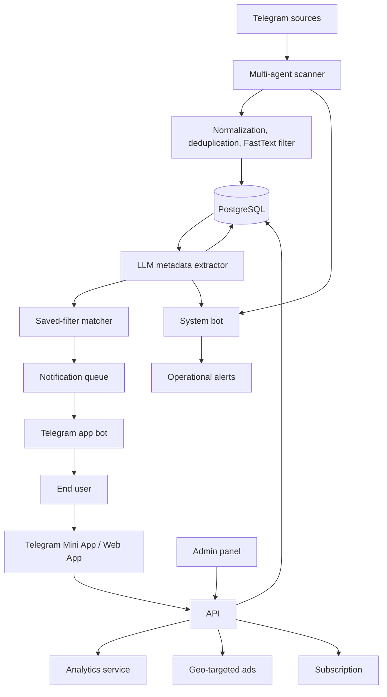

# Immigrant Info

The platform monitors selected Telegram sources (chats, channels), filters noisy messages, classifies useful posts with ML/LLM assistance, enriches them with structured metadata, and exposes the result through a Telegram-first web app.

The product is aimed at people who need fast access to local community information: housing, jobs, services, goods, local news, urgent requests, and useful contacts. Instead of manually reading many Telegram sources, users can search, filter, save needs, and receive alerts when relevant posts appear.

## Product Capabilities

- Telegram Mini App / web app for end users.
- Admin panel for operations, agents, traffic, users, and analytics.
- Multi-agent Telegram scanner for monitored groups and channels.
- Text normalization, deduplication, spam/quality filtering, and FastText-based validation.
- LLM-based post classification into categories and intent types.
- Search and filtering by country, region, category, language, post type, keyword, and period.
- Saved filters with positive and negative keywords.
- Instant and digest Telegram notifications.
- Subscription flow with payment provider integration.
- Geo-targeted advertising and campaign tracking.
- Internal system bot for operational alerts and agent login workflows.
- Internal analytics.

## Modular architecture

- `scanner`: connects Telegram agents to monitored sources and streams new messages.
- `filter`: normalizes text, rejects invalid content, deduplicates, batches DB writes.
- `extractor`: classifies posts with an LLM provider and enriches metadata.
- `matcher`: matches analyzed posts against saved user filters and notification rules.
- `app-bot`: handles Telegram user authentication and notification delivery.
- `system-bot`: sends internal operational alerts and agent login events.
- `api`: exposes public API endpoints.
- `analytics`: collects and aggregates behavioral and traffic metrics.
- `ads`: serves weighted geo-targeted ad placements.
- `cleaner`: performs scheduled database maintenance.

## System

